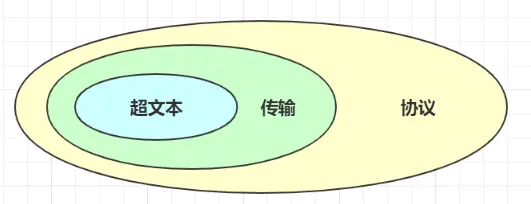
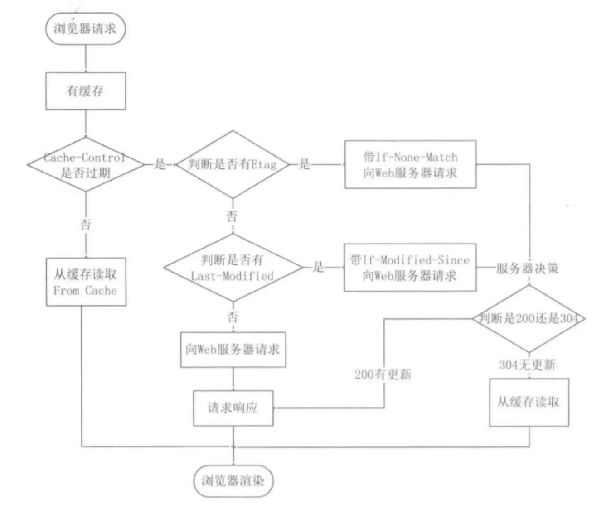
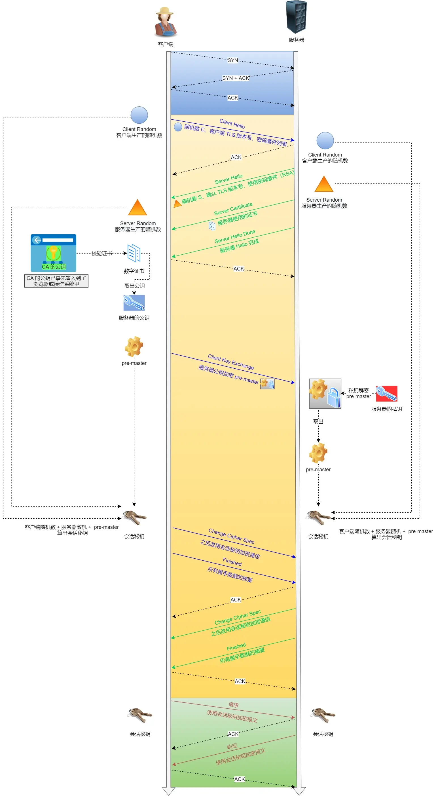
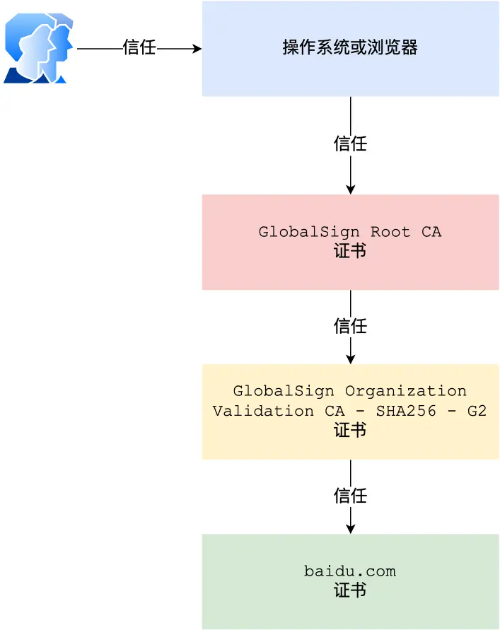
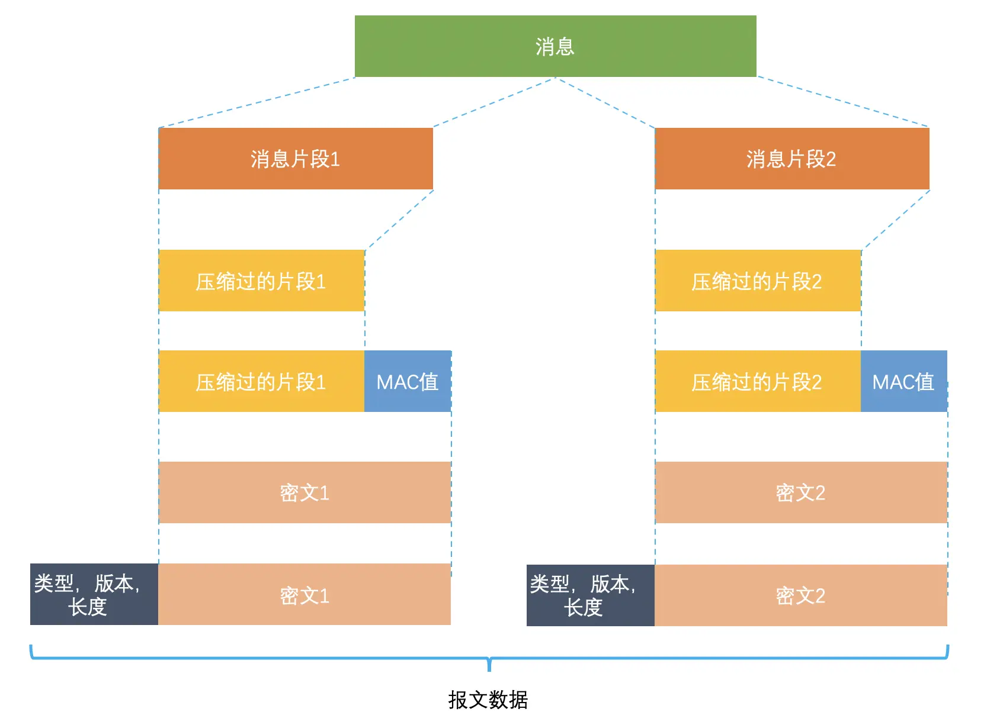

## HTTP

HTTP 的名字「超文本协议传输」，它可以拆成三个部分：

- 超文本
- 传输
- 协议

### HTTP 常见的状态码有哪些？

### HTTP 常见字段有哪些？

*Host* 字段

客户端发送请求时，用来指定服务器的域名。

Content-Length 字段 

服务器在返回数据时，会有 Content-Length 字段，表明本次回应的数据长度。

Connection 字段 

Connection 字段最常用于客户端要求服务器使用「HTTP 长连接」机制，以便其他请求复用。

Content-Type 字段 

Content-Type 字段用于服务器回应时，告诉客户端，本次数据是什么格式。

Content-Encoding 字段 

Content-Encoding 字段说明数据的压缩方法。表示服务器返回的数据使用了什么压缩格式

#### get和post操作

GET 方法就是安全且幂等的，因为它是「只读」操作，无论操作多少次，服务器上的数据都是安全的，且每次的结果都是相同的。所以，可以对 GET 请求的数据做缓存，这个缓存可以做到浏览器本身上（彻底避免浏览器发请求），也可以做到代理上（如nginx），而且在浏览器中 GET 请求可以保存为书签。 

POST 因为是「新增或提交数据」的操作，会修改服务器上的资源，所以是不安全的，且多次提交数据就会创建多个资源，所以不是幂等的。所以，浏览器一般不会缓存 POST 请求，也不能把 POST 请求保存为书签。

### HTTP 缓存技术

HTTP 缓存有两种实现方式，分别是强制缓存和协商缓存。

#### 什么是强制缓存？

强缓存指的是只要浏览器判断缓存没有过期，则直接使用浏览器的本地缓存，决定是否使用缓存的主动性在于浏览器这边。

强缓存是利用下面这两个 HTTP 响应头部（Response Header）字段实现的，它们都用来表示资源在客户端缓存的有效期： Cache-Control， 是一个相对时间； Expires，是一个绝对时间； 如果 HTTP 响应头部同时有 Cache-Control 和 Expires 字段的话，Cache-Control 的优先级高于 Expires 。

Cache-control 选项更多一些，设置更加精细，所以建议使用 Cache-Control 来实现强缓存。具体的实现流程如下： 当浏览器第一次请求访问服务器资源时，服务器会在返回这个资源的同时，在 Response 头部加上 Cache-Control，Cache-Control 中设置了过期时间大小； 浏览器再次请求访问服务器中的该资源时，会先通过请求资源的时间与 Cache-Control 中设置的过期时间大小，来计算出该资源是否过期，如果没有，则使用该缓存，否则重新请求服务器； 服务器再次收到请求后，会再次更新 Response 头部的 Cache-Control。

#### 什么是协商缓存？

所以协商缓存就是与服务端协商之后，通过协商结果来判断是否使用本地缓存。 

协商缓存可以基于两种头部来实现。 第一种：请求头部中的 If-Modified-Since 字段与响应头部中的 Last-Modified 字段实现，这两个字段的意思是： 响应头部中的 Last-Modified：标示这个响应资源的最后修改时间； 请求头部中的 If-Modified-Since：当资源过期了，发现响应头中具有 Last-Modified 声明，则再次发起请求的时候带上 Last-Modified 的时间，服务器收到请求后发现有 If-Modified-Since 则与被请求资源的最后修改时间进行对比（Last-Modified），如果最后修改时间较新（大），说明资源又被改过，则返回最新资源，HTTP 200 OK；如果最后修改时间较旧（小），说明资源无新修改，响应 HTTP 304 走缓存。

 第二种：请求头部中的 If-None-Match 字段与响应头部中的 ETag 字段，这两个字段的意思是： 响应头部中 Etag：唯一标识响应资源； 请求头部中的 If-None-Match：当资源过期时，浏览器发现响应头里有 Etag，则再次向服务器发起请求时，会将请求头 If-None-Match 值设置为 Etag 的值。服务器收到请求后进行比对，如果资源没有变化返回 304，如果资源变化了返回 200。 第一种实现方式是基于时间实现的，第二种实现方式是基于一个唯一标识实现的，相对来说后者可以更加准确地判断文件内容是否被修改，避免由于时间篡改导致的不可靠问题。

#### 缓存流程

##  HTTP 特性

HTTP/1.1 的优点有哪些？

 HTTP 最突出的优点是「简单、灵活和易于扩展、应用广泛和跨平台」。 

1. 简单 HTTP 基本的报文格式就是 header + body，头部信息也是 key-value 简单文本的形式，易于理解，降低了学习和使用的门槛。 
2. 灵活和易于扩展 HTTP 协议里的各类请求方法、URI/URL、状态码、头字段等每个组成要求都没有被固定死，都允许开发人员自定义和扩充。 同时 HTTP 由于是工作在应用层（ OSI 第七层），则它下层可以随意变化，比如： HTTPS 就是在 HTTP 与 TCP 层之间增加了 SSL/TLS 安全传输层； HTTP/1.1 和 HTTP/2.0 传输协议使用的是 TCP 协议，而到了 HTTP/3.0 传输协议改用了 UDP 协议。 
3. 应用广泛和跨平台 互联网发展至今，HTTP 的应用范围非常的广泛，从台式机的浏览器到手机上的各种 APP，从看新闻、刷贴吧到购物、理财、吃鸡，HTTP 的应用遍地开花，同时天然具有跨平台的优越性。

HTTP/1.1 的缺点有哪些？ HTTP 协议里有优缺点一体的双刃剑，分别是「无状态、明文传输」，同时还有一大缺点「不安全」。

Cookie 的作用就是在客户端（浏览器）保存一些信息，并在之后的请求里自动携带给服务器，让服务器“识别”这是同一个用户。

下图cookie流程

## https优势

安全与性能 安全使用混合加密 

## 公钥私钥互用用途

### 1️⃣ 公钥加密 → 私钥解密

- **目的**：保证 **内容传输安全**（Confidentiality）
- **原理**：
  - 发送方用接收方 **公钥** 加密消息
  - 只有接收方 **私钥** 能解密
- **效果**：
  - 中间人即使截获消息，也无法解密
  - 确保消息在传输过程中 **保密**

📌 典型应用：TLS 握手中客户端用服务器公钥加密 Pre-Master Secret（R3）

------

### 2️⃣ 私钥加密 → 公钥解密

- **目的**：保证 **消息来源可信**（Authentication / Non-repudiation）
- **原理**：
  - 发送方用自己的 **私钥** 对消息或消息摘要加密 → 数字签名
  - 接收方用发送方 **公钥** 解密
- **效果**：
  - 解密成功 → 消息确实由持有私钥的人发送
  - 同时结合哈希值 → 还可以验证消息 **未被篡改**
- **注意**：通常只对 **消息摘要（哈希值）** 加密，不直接加密整个消息（效率低）

📌 典型应用：HTTPS 证书签名、邮件签名、软件签名

## 混合加密实现流程（以 TLS 1.2 为例）

1. **客户端发起连接 (ClientHello)**
   - 浏览器告诉服务器自己支持哪些加密算法（对称、非对称、哈希算法等）。
   - 同时发一个随机数 `R1`。
2. **服务器响应 (ServerHello)**
   - 服务器选择最终用的加密算法，返回另一个随机数 `R2`。
   - 并发回自己的 **数字证书（含公钥）**，证明身份。
3. **客户端生成会话密钥 (Pre-Master Secret)**
   - 客户端生成一个新的随机数 `R3`，作为 **对称密钥种子**。
   - 用服务器公钥加密 `R3`，发给服务器。
4. **服务器解密会话密钥**
   - 服务器用自己的 **私钥** 解密出 `R3`。
   - 这样客户端和服务器就同时拥有了 `R1 + R2 + R3`，可以生成相同的 **会话密钥 (Session Key)**。
5. **对称加密正式启用**
   - 从这一刻开始，双方用这个 **会话密钥**（对称加密算法 AES/ChaCha20）来加密所有数据。
   - 非对称加密阶段结束。

### 1️⃣ 数字证书里 CA 的作用

- **证书包含**：
  - 服务器公钥
  - 服务器身份信息
  - **CA 的签名**
- **CA 的签名**是怎么生成的：
  1. CA 对证书里的主要内容（公钥 + 身份信息）做 **哈希运算** → 得到摘要
  2. 用 **CA 私钥** 对摘要加密 → 得到数字签名
  3. 数字签名附加到证书里 → 完整证书就生成了

------

### 2️⃣ 客户端验证证书

1. 客户端收到证书
2. 用 CA 公钥解密证书里的数字签名 → 得到摘要
3. 客户端自己对证书内容计算哈希值 → 得到自己的摘要
4. 对比两者：
   - 相同 → 证书合法，公钥可信
   - 不同 → 证书被篡改，不可信

> ⚠️ 注意：整个证书不是被 CA 私钥“加密”，只是摘要被加密生成签名 → 用来验证证书合法性

## 数字证书ca

### 关键点

- **问题根源**：客户端/接收方无法确认公钥真实身份（等于 伪造者用自己的私钥加密 然后给你伪造的公钥 ）
- **解决方法**：
  - 引入 **数字证书 + CA 签名**
  - CA 签名可以证明公钥和身份是绑定的
  - 即使伪造者给你自己的公钥，也无法得到 CA 的签名 → 验证失败

## tcp+tls 流程

1. ClientHello 首先，由客户端向服务器发起加密通信请求，也就是 ClientHello 请求。 在这一步，客户端主要向服务器发送以下信息： （1）客户端支持的 TLS 协议版本，如 TLS 1.2 版本。 （2）客户端生产的随机数（Client Random），后面用于生成「会话秘钥」条件之一。 （3）客户端支持的密码套件列表，如 RSA 加密算法。 
2. SeverHello 服务器收到客户端请求后，向客户端发出响应，也就是 SeverHello。服务器回应的内容有如下内容： （1）确认 TLS 协议版本，如果浏览器不支持，则关闭加密通信。 （2）服务器生产的随机数（Server Random），也是后面用于生产「会话秘钥」条件之一。 （3）确认的密码套件列表，如 RSA 加密算法。 （4）服务器的数字证书。
3. 客户端回应 客户端收到服务器的回应之后，首先通过浏览器或者操作系统中的 CA 公钥，确认服务器的数字证书的真实性。 如果证书没有问题，客户端会从数字证书中取出服务器的公钥，然后使用它加密报文，向服务器发送如下信息： （1）一个随机数（pre-master key）。该随机数会被服务器公钥加密。 （2）加密通信算法改变通知，表示随后的信息都将用「会话秘钥」加密通信。 （3）客户端握手结束通知，表示客户端的握手阶段已经结束。这一项同时把之前所有内容的发生的数据做个摘要，用来供服务端校验。 上面第一项的随机数是整个握手阶段的第三个随机数，会发给服务端，所以这个随机数客户端和服务端都是一样的。 服务器和客户端有了这三个随机数（Client Random、Server Random、pre-master key），接着就用双方协商的加密算法，各自生成本次通信的「会话秘钥」。 
4. 服务器的最后回应 服务器收到客户端的第三个随机数（pre-master key）之后，通过协商的加密算法，计算出本次通信的「会话秘钥」。 然后，向客户端发送最后的信息： （1）加密通信算法改变通知，表示随后的信息都将用「会话秘钥」加密通信。 （2）服务器握手结束通知，表示服务器的握手阶段已经结束。这一项同时把之前所有内容的发生的数据做个摘要，用来供客户端校验。 至此，整个 TLS 的握手阶段全部结束。接下来，客户端与服务器进入加密通信，就完全是使用普通的 HTTP 协议，只不过用「会话秘钥」加密内容。

## 证书验证流程

##### tls 数据分割

具体过程如下： 首先，消息被分割成多个较短的片段,然后分别对每个片段进行压缩。 接下来，经过压缩的片段会被加上消息认证码（MAC 值，这个是通过哈希算法生成的），这是为了保证完整性，并进行数据的认证。通过附加消息认证码的 MAC 值，可以识别出篡改。与此同时，为了防止重放攻击，在计算消息认证码时，还加上了片段的编码。 再接下来，经过压缩的片段再加上消息认证码会一起通过对称密码进行加密。 最后，上述经过加密的数据再加上由数据类型、版本号、压缩后的长度组成的报头就是最终的报文数据。 记录协议完成后，最终的报文数据将传递到传输控制协议 (TCP) 层进行传输。