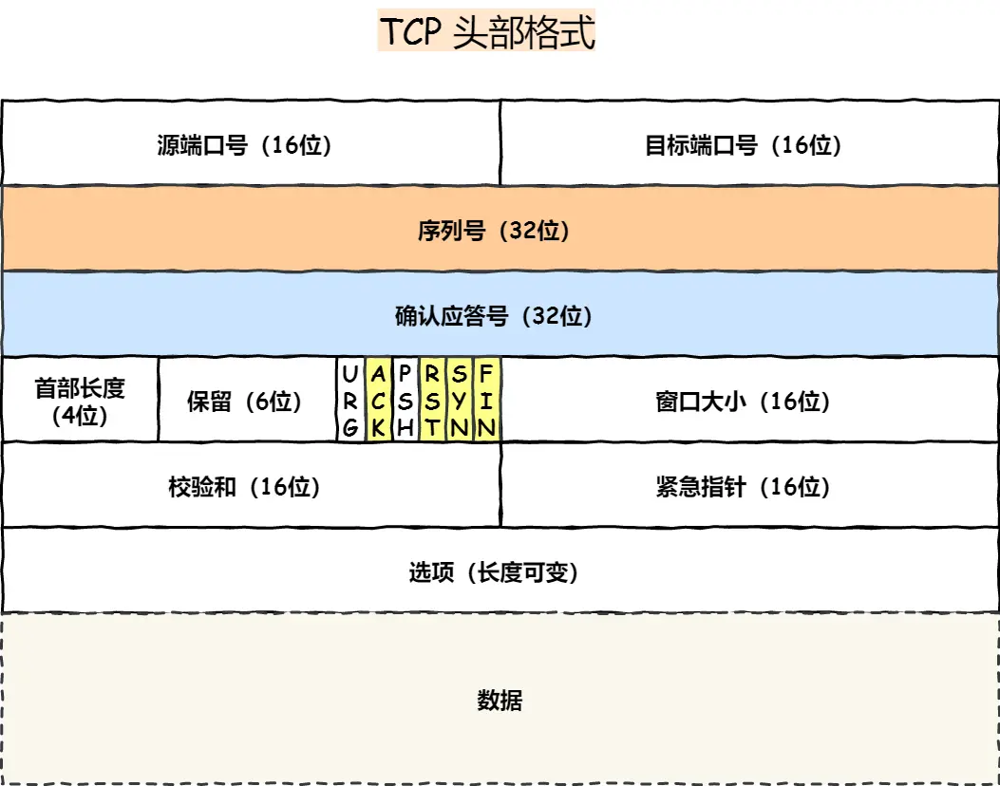
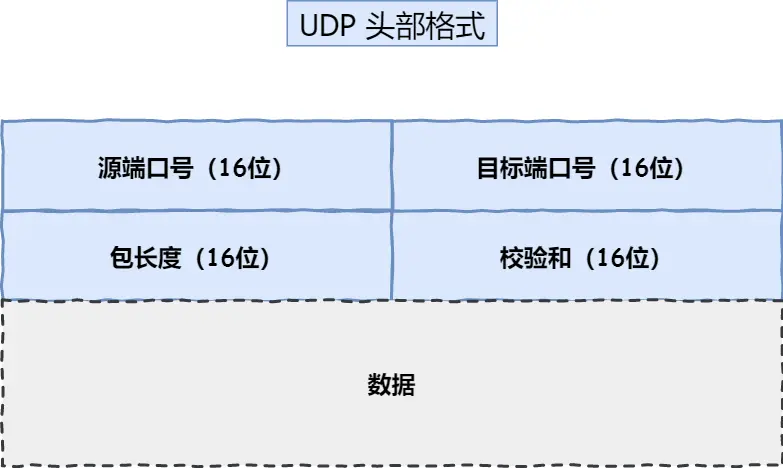
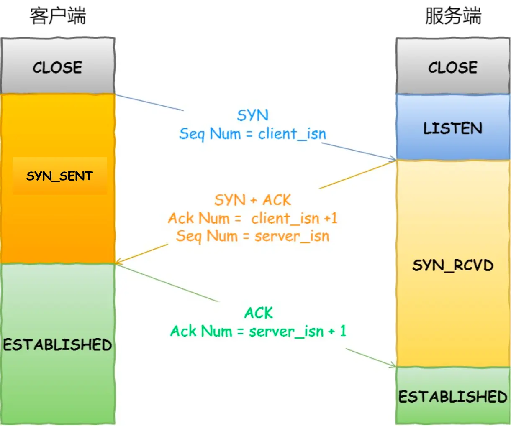
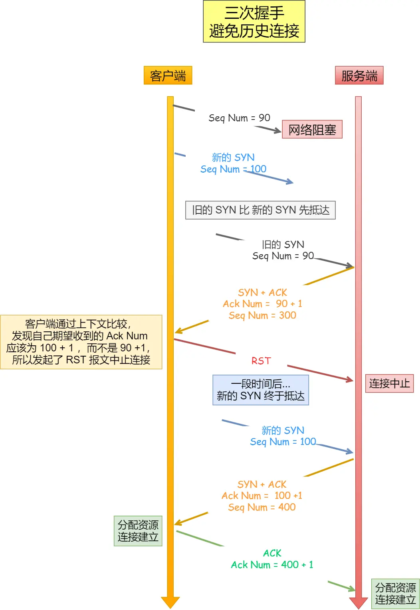

## TCP

### TCP头部

序列号：在建立连接时由计算机生成的随机数作为其初始值，通过 SYN 包传给接收端主机，每发送一次数据，就「累加」一次该「数据字节数」的大小。用来解决网络包乱序问题。

确认应答号：指下一次「期望」收到的数据的序列号，发送端收到这个确认应答以后可以认为在这个序号以前的数据都已经被正常接收。用来解决丢包的问题。 

控制位： ACK：该位为 1 时，「确认应答」的字段变为有效，TCP 规定除了最初建立连接时的 SYN 包之外该位必须设置为 1 。 RST：该位为 1 时，表示 TCP 连接中出现异常必须强制断开连接。 SYN：该位为 1 时，表示希望建立连接，并在其「序列号」的字段进行序列号初始值的设定。 FIN：该位为 1 时，表示今后不会再有数据发送，希望断开连接。当通信结束希望断开连接时，通信双方的主机之间就可以相互交换 FIN 位为 1 的 TCP 段。

### TCP特性

TCP 是**面向连接的、可靠的、基于字节流**的传输层通信协议。

面向连接：一定是「一对一」才能连接，不能像 UDP 协议可以一个主机同时向多个主机发送消息，也就是一对多是无法做到的；

可靠的：无论的网络链路中出现了怎样的链路变化，TCP 都可以保证一个报文一定能够到达接收端；

 字节流：用户消息通过 TCP 协议传输时，消息可能会被操作系统「分组」成多个的 TCP 报文，如果接收方的程序如果不知道「消息的边界」，是无法读出一个有效的用户消息的。并且 TCP 报文是「有序的」，当「前一个」TCP 报文没有收到的时候，即使它先收到了后面的 TCP 报文，那么也不能扔给应用层去处理，同时对「重复」的 TCP 报文会自动丢弃。 

#### 什么是 TCP 连接？

简单来说就是，用于保证可靠性和流量控制维护的某些状态信息，这些信息的组合，包括 Socket、序列号和窗口大小称为连接。

所以我们可以知道，建立一个 TCP 连接是需要客户端与服务端达成上述三个信息的共识。 

Socket：由 IP 地址和端口号组成 

序列号：用来解决乱序问题等

窗口大小：用来做流量控制

#### 如何唯一确定一个 TCP 连接呢？

TCP 四元组可以唯一的确定一个连接，四元组包括如下： 源地址 源端口 目的地址 目的端口

## UDP

### udp头部格式

## TCP 和 UDP 区别：

1. 连接 TCP 是面向连接的传输层协议，传输数据前先要建立连接。 UDP 是不需要连接，即刻传输数据。

2. 服务对象 TCP 是一对一的两点服务，即一条连接只有两个端点。 UDP 支持一对一、一对多、多对多的交互通信

3. 可靠性 TCP 是可靠交付数据的，数据可以无差错、不丢失、不重复、按序到达。 UDP 是尽最大努力交付，不保证可靠交付数据。但是我们可以基于 UDP 传输协议实现一个可靠的传输协议，比如 QUIC 协议，具体可以参见这篇文章：如何基于 UDP 协议实现可靠传输？(opens new window) 

4. 拥塞控制、流量控制 TCP 有拥塞控制和流量控制机制，保证数据传输的安全性。 UDP 则没有，即使网络非常拥堵了，也不会影响 UDP 的发送速率。

5. 首部开销 TCP 首部长度较长，会有一定的开销，首部在没有使用「选项」字段时是 20 个字节，如果使用了「选项」字段则会变长的。 UDP 首部只有 8 个字节，并且是固定不变的，开销较小。 
6. 传输方式 TCP 是流式传输，没有边界，但保证顺序和可靠。 UDP 是一个包一个包的发送，是有边界的，但可能会丢包和乱序。 
7. 分片不同 TCP 的数据大小如果大于 MSS 大小，则会在传输层进行分片，目标主机收到后，也同样在传输层组装 TCP 数据包，如果中途丢失了一个分片，只需要传输丢失的这个分片。 UDP 的数据大小如果大于 MTU 大小，则会在 IP 层进行分片，目标主机收到后，在 IP 层组装完数据，接着再传给传输层。

## TCP 和 UDP 应用场景： 

由于 TCP 是面向连接，能保证数据的可靠性交付，因此经常用于： FTP 文件传输； HTTP / HTTPS； 由于 UDP 面向无连接，它可以随时发送数据，再加上 UDP 本身的处理既简单又高效，因此经常用于： 包总量较少的通信，如 DNS 、SNMP 等； 视频、音频等多媒体通信； 广播通信；

## TCP 连接建立 

### TCP 三次握手过程是怎样的？ 

TCP 是面向连接的协议，所以使用 TCP 前必须先建立连接，而建立连接是通过三次握手来进行的。三次握手的过程如下图：

### 为什么是三次握手？不是两次、四次？

接下来，以三个方面分析三次握手的原因：

三次握手才可以阻止重复历史连接的初始化（主要原因） 

三次握手才可以同步双方的初始序列号 

三次握手才可以避免资源浪费

原因一

上图 rst 在新的syn到之前的情况 

如果 rst 在新的syn之后到呢

- **客户端发的新 SYN（ISN=100）最开始没有被服务端接受**，因为服务端当时还在处理旧 SYN 半连接，只是回了一个 **Challenge ACK**。
- 客户端收到了这个“不对的 ACK=91”，就发了 **RST**，把服务端的旧半连接干掉。(干掉91)
- **但客户端的 TCP 状态机仍然在 `SYN-SENT` 状态**（它自己认为“我还在等对方回应我的 SYN(100)”）。
- 按照 TCP 的机制，`SYN-SENT` 状态下如果超时没有等到正确的 `SYN+ACK(ack=101)`，客户端会 **重传 SYN(100)**。

等到服务端那边旧半连接被 RST 清理掉之后，再收到重传的 `SYN(100)`，这时它就能把这个 SYN 当作一个**新的建连请求**，进入正常的三次握手。

原因二：同步双方初始序列号 TCP 协议的通信双方， 都必须维护一个「序列号」， 序列号是可靠传输的一个关键因素，

它的作用：

接收方可以去除重复的数据； 

接收方可以根据数据包的序列号按序接收；

可以标识发送出去的数据包中， 哪些是已经被对方收到的（通过 ACK 报文中的序列号知道）；

原因三：避免资源浪费 如果只有「两次握手」，当客户端发生的 SYN 报文在网络中阻塞，客户端没有接收到 ACK 报文，就会重新发送 SYN ，由于没有第三次握手，服务端不清楚客户端是否收到了自己回复的 ACK 报文，所以服务端每收到一个 SYN 就只能先主动建立一个连接，这会造成什么情况呢？ 如果客户端发送的 SYN 报文在网络中阻塞了，重复发送多次 SYN 报文，那么服务端在收到请求后就会建立多个冗余的无效链接，造成不必要的资源浪费。

### tcp使用mss 而不是依赖mtu分片

TCP 使用 MSS，就是为了让一个 TCP 报文段装进一个 IP 包，不超过 MTU，从而避免 IP 分片 

如果使用ip分片 传输遗漏了 到时候重传需要重传这个 tcp包 

#### TCP 如何处理 MTU 不同的情况

1. **MSS 协商**
   - TCP 在 **三次握手** 时会互相通告自己的 MSS（一般等于本机接口的 MTU 减去 40 字节头部）。
   - 双方都会记录对方通告的 MSS，实际发送时取 **双方通告值的最小值**。
   - 这样保证了发送方不会发出超过对方能承受的数据块。

##### 第一次握手失败

**客户端行为**：

- 客户端发出的 `SYN` 没有得到响应（因为丢失了）。
- TCP 有超时重传机制，会在 **RTO (Retransmission Timeout)** 超时后，**重发 SYN**。
- 一般实现是 **指数回退重传**（RTT×2、RTT×4…），最多重传几次（通常 5~6 次）。
- 如果一直没收到服务端回应，客户端最终会报错：`Connection timed out`。

**服务端行为**：

- 由于没收到 `SYN`，服务端啥都不知道，不会进入半连接队列，也就不会有任何动作。

##### 第二次握手失败

客户端会重传 SYN 报文，也就是第一次握手，最大重传次数由 tcp_syn_retries内核参数决定；

服务端会重传 SYN-ACK 报文，也就是第二次握手，最大重传次数由 tcp_synack_retries 内核参数决定。

##### 第三次握手失败

客户端收到服务端的 SYN-ACK 报文后，就会给服务端回一个 ACK 报文，也就是第三次握手，此时客户端状态进入到 ESTABLISH 状态。 因为这个第三次握手的 ACK 是对第二次握手的 SYN 的确认报文，所以当第三次握手丢失了，如果服务端那一方迟迟收不到这个确认报文，就会触发超时重传机制，重传 SYN-ACK 报文，直到收到第三次握手，或者达到最大重传次数。 注意，ACK 报文是不会有重传的，当 ACK 丢失了，就由对方重传对应的报文。

### TCP四次挥手

客户端打算关闭连接，此时会发送一个 TCP 首部 FIN 标志位被置为 1 的报文，也即 FIN 报文，之后客户端进入 FIN_WAIT_1 状态。 

服务端收到该报文后，就向客户端发送 ACK 应答报文，接着服务端进入 CLOSE_WAIT 状态。 

客户端收到服务端的 ACK 应答报文后，之后进入 FIN_WAIT_2 状态。

等待服务端处理完数据后，也向客户端发送 FIN 报文，之后服务端进入 LAST_ACK 状态。 

客户端收到服务端的 FIN 报文后，回一个 ACK 应答报文，之后进入 TIME_WAIT 状态 服务端收到了 ACK 应答报文后，就进入了 CLOSE 状态，至此服务端已经完成连接的关闭。 

客户端在经过 2MSL 一段时间后，自动进入 CLOSE 状态，至此客户端也完成连接的关闭。 你可以看到，每个方向都需要一个 FIN 和一个 ACK，因此通常被称为四次挥手。 

这里一点需要注意是：主动关闭连接的，才有 TIME_WAIT 状态。

##### 第一次挥手丢失了，会发生什么？

 当客户端（主动关闭方）调用 close 函数后，就会向服务端发送 FIN 报文，试图与服务端断开连接，此时客户端的连接进入到 FIN_WAIT_1 状态。 正常情况下，如果能及时收到服务端（被动关闭方）的 ACK，则会很快变为 FIN_WAIT2状态。 如果第一次挥手丢失了，那么客户端迟迟收不到被动方的 ACK 的话，也就会触发超时重传机制，重传 FIN 报文，重发次数由 tcp_orphan_retries 参数控制。 当客户端重传 FIN 报文的次数超过 tcp_orphan_retries 后，就不再发送 FIN 报文，则会在等待一段时间（时间为上一次超时时间的 2 倍），如果还是没能收到第二次挥手，那么直接进入到 close 状态。

##### 第二次挥手丢失了，会发生什么？

当服务端收到客户端的第一次挥手后，就会先回一个 ACK 确认报文，此时服务端的连接进入到 CLOSE_WAIT 状态。 在前面我们也提了，ACK 报文是不会重传的，所以如果服务端的第二次挥手丢失了，客户端就会触发超时重传机制，重传 FIN 报文，直到收到服务端的第二次挥手，或者达到最大的重传次数。

 

##### 收到第二次挥手后 等待服务端fin 如果等不到？（本质是第三次挥手收不到）

这里提一下，当客户端收到第二次挥手，也就是收到服务端发送的 ACK 报文后，客户端就会处于 FIN_WAIT2 状态，在这个状态需要等服务端发送第三次挥手，也就是服务端的 FIN 报文。 对于 close 函数关闭的连接，由于无法再发送和接收数据，所以FIN_WAIT2 状态不可以持续太久，而 tcp_fin_timeout 控制了这个状态下连接的持续时长，默认值是 60 秒。

这意味着对于调用 close 关闭的连接，如果在 60 秒后还没有收到 FIN 报文，客户端（主动关闭方）的连接就会直接关闭

但是注意，如果主动关闭方使用 shutdown 函数关闭连接，指定了只关闭发送方向，而接收方向并没有关闭，那么意味着主动关闭方还是可以接收数据的。 此时，如果主动关闭方一直没收到第三次挥手，那么主动关闭方的连接将会一直处于 FIN_WAIT2 状态（tcp_fin_timeout 无法控制 shutdown 关闭的连接）。

##### 第四次挥手丢失了，会发生什么？ 

当客户端收到服务端的第三次挥手的 FIN 报文后，就会回 ACK 报文，也就是第四次挥手，此时客户端连接进入 TIME_WAIT 状态。 在 Linux 系统，TIME_WAIT 状态会持续 2MSL 后才会进入关闭状态。 然后，服务端（被动关闭方）没有收到 ACK 报文前，还是处于 LAST_ACK 状态。 如果第四次挥手的 ACK 报文没有到达服务端，服务端就会重发 FIN 报文，重发次数仍然由前面介绍过的 tcp_orphan_retries 参数控制。

##### 为什么 TIME_WAIT 等待的时间是 2MSL？

MSL 是 Maximum Segment Lifetime，报文最大生存时间，它是任何报文在网络上存在的最长时间，超过这个时间报文将被丢弃。因为 TCP 报文基于是 IP 协议的，而 IP 头中有一个 TTL 字段，是 IP 数据报可以经过的最大路由数，每经过一个处理他的路由器此值就减 1，当此值为 0 则数据报将被丢弃，同时发送 ICMP 报文通知源主机。 MSL 与 TTL 的区别： MSL 的单位是时间，而 TTL 是经过路由跳数。所以 MSL 应该要大于等于 TTL 消耗为 0 的时间，以确保报文已被自然消亡。 TTL 的值一般是 64，Linux 将 MSL 设置为 30 秒，意味着 Linux 认为数据报文经过 64 个路由器的时间不会超过 30 秒，如果超过了，就认为报文已经消失在网络中了。 TIME_WAIT 等待 2 倍的 MSL，比较合理的解释是： 网络中可能存在来自发送方的数据包，当这些发送方的数据包被接收方处理后又会向对方发送响应，所以一来一回需要等待 2 倍的时间。 比如，如果被动关闭方没有收到断开连接的最后的 ACK 报文，就会触发超时重发 FIN 报文，另一方接收到 FIN 后，会重发 ACK 给被动关闭方， 一来一去正好 2 个 MSL。 可以看到 2MSL时长 这其实是相当于至少允许报文丢失一次。比如，若 ACK 在一个 MSL 内丢失，这样被动方重发的 FIN 会在第 2 个 MSL 内到达，TIME_WAIT 状态的连接可以应对。 为什么不是 4 或者 8 MSL 的时长呢？你可以想象一个丢包率达到百分之一的糟糕网络，连续两次丢包的概率只有万分之一，这个概率实在是太小了，忽略它比解决它更具性价比。 2MSL 的时间是从客户端接收到 FIN 后发送 ACK 开始计时的。如果在 TIME-WAIT 时间内，因为客户端的 ACK 没有传输到服务端，客户端又接收到了服务端重发的 FIN 报文，那么 2MSL 时间将重新计时。 在 Linux 系统里 2MSL 默认是 60 秒，那么一个 MSL 也就是 30 秒。Linux 系统停留在 TIME_WAIT 的时间为固定的 60 秒。

##### 为什么需要 TIME_WAIT 状态？ 

主动发起关闭连接的一方，才会有 TIME-WAIT 状态。 需要 TIME-WAIT 状态，主要是两个原因： 防止历史连接中的数据，被后面相同四元组的连接错误的接收； 保证「被动关闭连接」的一方，能被正确的关闭；

##### TIME_WAIT 过多有什么危害？ 

过多的 TIME-WAIT 状态主要的危害有两种： 第一是占用系统资源，比如文件描述符、内存资源、CPU 资源、线程资源等； 第二是占用端口资源，端口资源也是有限的，一般可以开启的端口为 32768～61000，也可以通过 net.ipv4.ip_local_port_range参数指定范围。