## 网络层

#### 数据链路和网络层

MAC 的作用则是实现「直连」的两个设备之间通信，而 IP 则负责在「没有直连」的两个网络之间进行通信传输。

#### IP 地址的分类

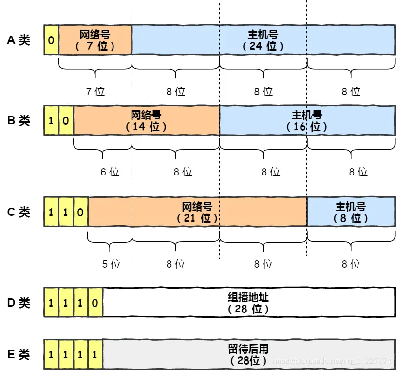

我们可以用下面这个表格， 就能很清楚的知道 A、B、C 分类对应的地址范围、最大主机个数。

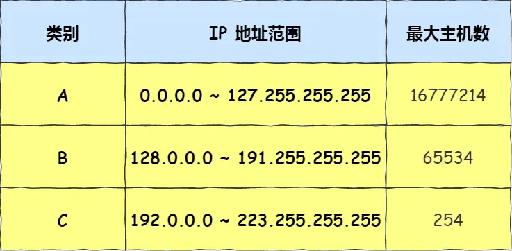

#### CIDR

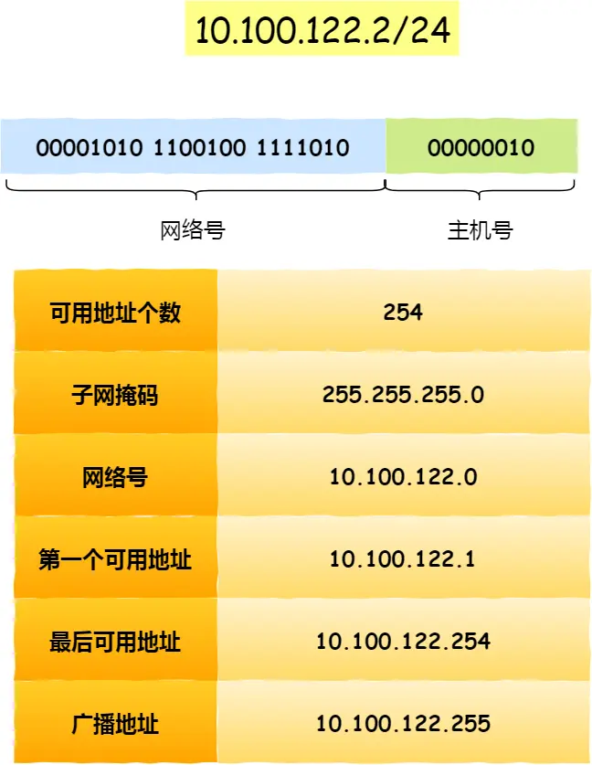

#### 子网掩码

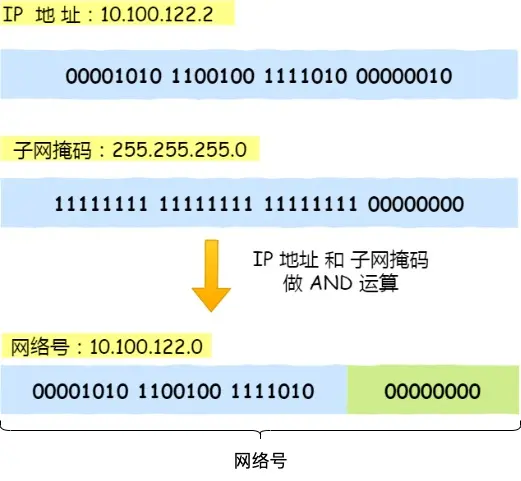

还有另一种划分网络号与主机号形式，那就是子网掩码，掩码的意思就是掩盖掉主机号，剩余的就是网络号。 将子网掩码和 IP 地址按位计算 AND，就可得到网络号。

未做子网划分的 ip 地址：网络地址＋主机地址 做子网划分后的 ip 地址：网络地址＋（子网网络地址＋子网主机地址）

#### 公有和私有ip地址

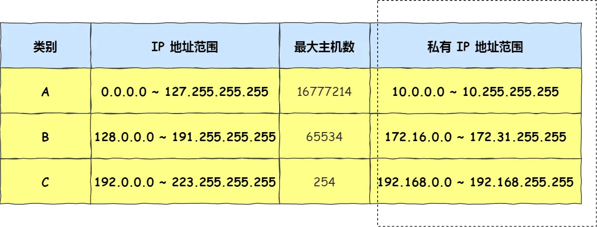

#### IP 分片与重组 

每种数据链路的最大传输单元 MTU 都是不相同的，如 FDDI 数据链路 MTU 4352、以太网的 MTU 是 1500 字节等。 每种数据链路的 MTU 之所以不同，是因为每个不同类型的数据链路的使用目的不同。使用目的不同，可承载的 MTU 也就不同。 其中，我们最常见数据链路是以太网，它的 MTU 是 1500 字节。 那么当 IP 数据包大小大于 MTU 时， IP 数据包就会被分片。 经过分片之后的 IP 数据报在被重组的时候，只能由目标主机进行，路由器是不会进行重组的。 假设发送方发送一个 4000 字节的大数据报，若要传输在以太网链路，则需要把数据报分片成 3 个小数据报进行传输，再交由接收方重组成大数据报。

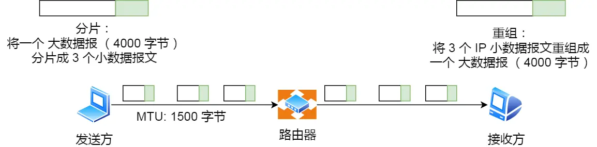

#### DNS

我们在上网的时候，通常使用的方式是域名，而不是 IP 地址，因为域名方便人类记忆。 那么实现这一技术的就是 DNS 域名解析，DNS 可以将域名网址自动转换为具体的 IP 地址。

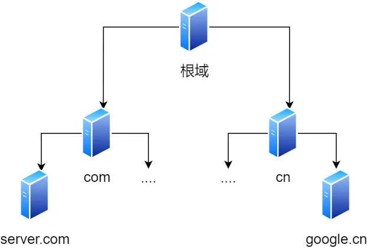

客户端首先会发出一个 DNS 请求，问 www.server.com 的 IP 是啥，并发给本地 DNS 服务器（也就是客户端的 TCP/IP 设置中填写的 DNS 服务器地址）。 本地域名服务器收到客户端的请求后，如果缓存里的表格能找到 www.server.com，则它直接返回 IP 地址。如果没有，本地 DNS 会去问它的根域名服务器：“老大， 能告诉我 www.server.com 的 IP 地址吗？” 根域名服务器是最高层次的，它不直接用于域名解析，但能指明一条道路。 根 DNS 收到来自本地 DNS 的请求后，发现后置是 .com，说：“www.server.com 这个域名归 .com 区域管理”，我给你 .com 顶级域名服务器地址给你，你去问问它吧。” 本地 DNS 收到顶级域名服务器的地址后，发起请求问“老二， 你能告诉我 www.server.com 的 IP 地址吗？” 顶级域名服务器说：“我给你负责 www.server.com 区域的权威 DNS 服务器的地址，你去问它应该能问到”。 本地 DNS 于是转向问权威 DNS 服务器：“老三，www.server.com对应的IP是啥呀？” server.com 的权威 DNS 服务器，它是域名解析结果的原出处。为啥叫权威呢？就是我的域名我做主。 权威 DNS 服务器查询后将对应的 IP 地址 X.X.X.X 告诉本地 DNS。 本地 DNS 再将 IP 地址返回客户端，客户端和目标建立连接。 至此，我们完成了 DNS 的解析过程。现在总结一下，整个过程我画成了一个图。

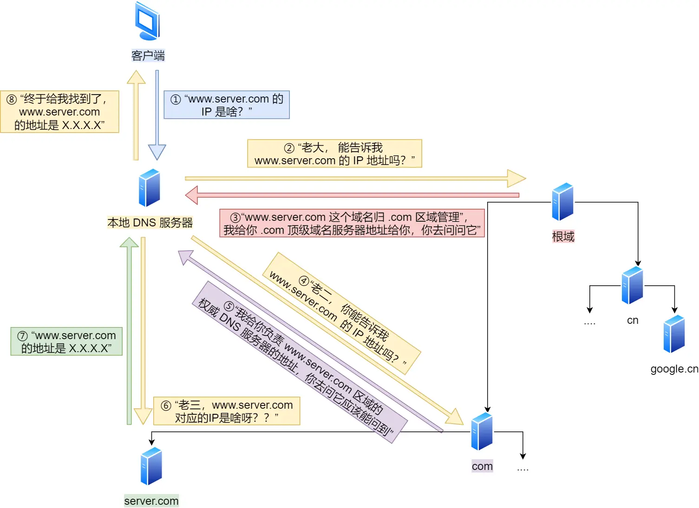

#### arp

主机会通过广播发送 ARP 请求，这个包中包含了想要知道的 MAC 地址的主机 IP 地址。 当同个链路中的所有设备收到 ARP 请求时，会去拆开 ARP 请求包里的内容，如果 ARP 请求包中的目标 IP 地址与自己的 IP 地址一致，那么这个设备就将自己的 MAC 地址塞入 ARP 响应包返回给主机。 操作系统通常会把第一次通过 ARP 获取的 MAC 地址缓存起来，以便下次直接从缓存中找到对应 IP 地址的 MAC 地址。 不过，MAC 地址的缓存是有一定期限的，超过这个期限，缓存的内容将被清除。

#### DHCP

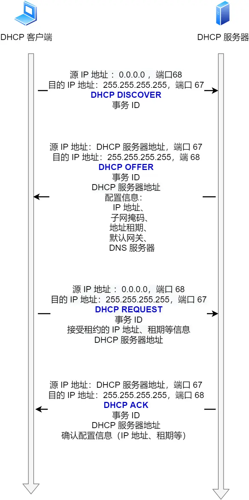

客户端首先发起 DHCP 发现报文（DHCP DISCOVER） 的 IP 数据报，由于客户端没有 IP 地址，也不知道 DHCP 服务器的地址，所以使用的是 UDP 广播通信，其使用的广播目的地址是 255.255.255.255（端口 67） 并且使用 0.0.0.0（端口 68） 作为源 IP 地址。DHCP 客户端将该 IP 数据报传递给链路层，链路层然后将帧广播到所有的网络中设备。 DHCP 服务器收到 DHCP 发现报文时，用 DHCP 提供报文（DHCP OFFER） 向客户端做出响应。该报文仍然使用 IP 广播地址 255.255.255.255，该报文信息携带服务器提供可租约的 IP 地址、子网掩码、默认网关、DNS 服务器以及 IP 地址租用期。 客户端收到一个或多个服务器的 DHCP 提供报文后，从中选择一个服务器，并向选中的服务器发送 DHCP 请求报文（DHCP REQUEST进行响应，回显配置的参数。 最后，服务端用 DHCP ACK 报文对 DHCP 请求报文进行响应，应答所要求的参数。

**全程都是使用 UDP 广播通信**

DHCP 中继代理。有了 DHCP 中继代理以后，对不同网段的 IP 地址分配也可以由一个 DHCP 服务器统一进行管理。

#### NAT

IPv4 的地址是非常紧缺的，在前面我们也提到可以通过无分类地址来减缓 IPv4 地址耗尽的速度，但是互联网的用户增速是非常惊人的，所以 IPv4 地址依然有被耗尽的危险。 于是，提出了一种网络地址转换 NAT 的方法，再次缓解了 IPv4 地址耗尽的问题。 简单的来说 NAT 就是同个公司、家庭、教室内的主机对外部通信时，把私有 IP 地址转换成公有 IP 地址。

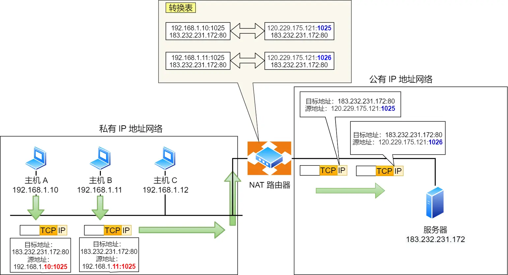

当然有缺陷，肯定没有十全十美的方案。 由于 NAT/NAPT 都依赖于自己的转换表，因此会有以下的问题： 

外部无法主动与 NAT 内部服务器建立连接，因为 NAPT 转换表没有转换记录。 

转换表的生成与转换操作都会产生性能开销。 

通信过程中，如果 NAT 路由器重启了，所有的 TCP 连接都将被重置。

#### ICMP

ICMP 全称是 Internet Control Message Protocol，也就是互联网控制报文协议。

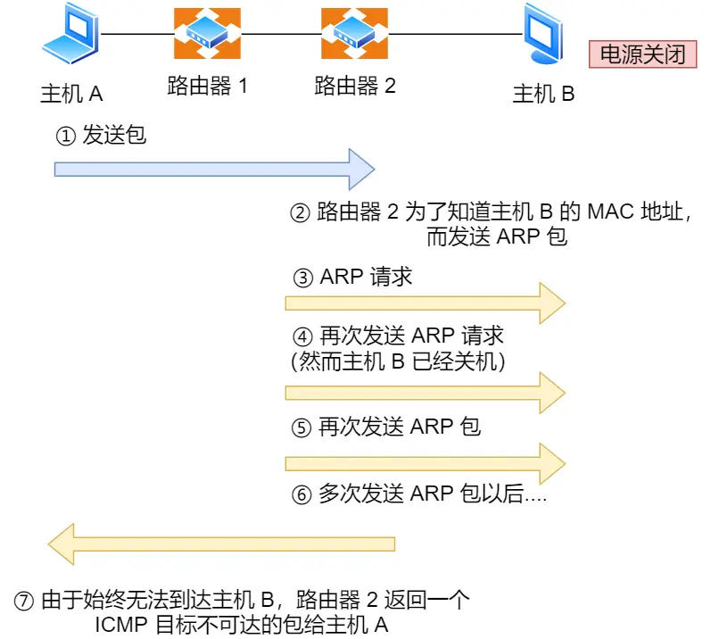

#### IGMP

IGMP 是 **主机 ↔ 路由器** 之间用来管理主机加入/离开组播组的协议，它的核心目标是：

1. **让路由器知道哪些组播组在当前网段内有人订阅。**
   - 路由器只转发「有人要的组播流量」，避免无谓的组播泛洪。
   - 如果没人订阅，路由器就不会在该网段转发这个组播流。
2. **动态维护组播成员关系。**
   - 主机加入组播组时，发送 **Membership Report**。
   - 主机离开组播组时，发送 **Leave Group**。
   - 路由器周期性发送 **Query** 来确认哪些组播组还活跃。
3. **减少冗余报文。**
   - 通过 **报告抑制机制**，只要有一个主机回应就够了。

#### 常规查询与响应工作机制

路由器会周期性发送目的地址为 224.0.0.1（表示同一网段内所有主机和路由器） IGMP 常规查询报文。 

主机1 和 主机 3 收到这个查询，随后会启动「报告延迟计时器」，计时器的时间是随机的，通常是 0~10 秒，计时器超时后主机就会发送 IGMP 成员关系报告报文（源 IP 地址为自己主机的 IP 地址，目的 IP 地址为组播地址）。如果在定时器超时之前，收到同一个组内的其他主机发送的成员关系报告报文，则自己不再发送，这样可以减少网络中多余的 IGMP 报文数量。

 路由器收到主机的成员关系报文后，就会在 IGMP 路由表中加入该组播组，后续网络中一旦该组播地址的数据到达路由器，它会把数据包转发出去。

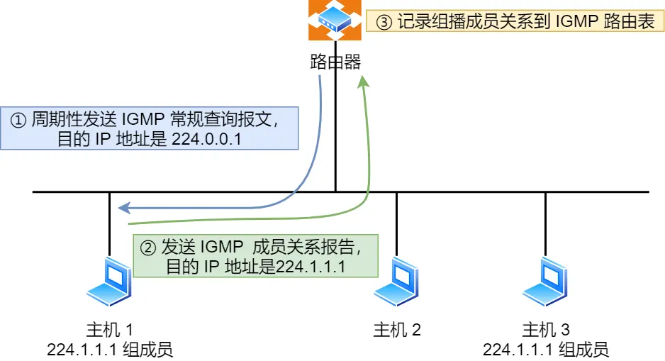

#### 离开组播组工作机制 

离开组播组的情况一，网段中仍有该组播组：

主机 1 要离开组 224.1.1.1，发送 IGMPv2 离组报文，报文的目的地址是 224.0.0.2（表示发向网段内的所有路由器） 路由器 收到该报文后，以 1 秒为间隔连续发送 IGMP 特定组查询报文（共计发送 2 个），以便确认该网络是否还有 224.1.1.1 组的其他成员。 主机 3 仍然是组 224.1.1.1 的成员，因此它立即响应这个特定组查询。路由器知道该网络中仍然存在该组播组的成员，于是继续向该网络转发 224.1.1.1 的组播数据包。

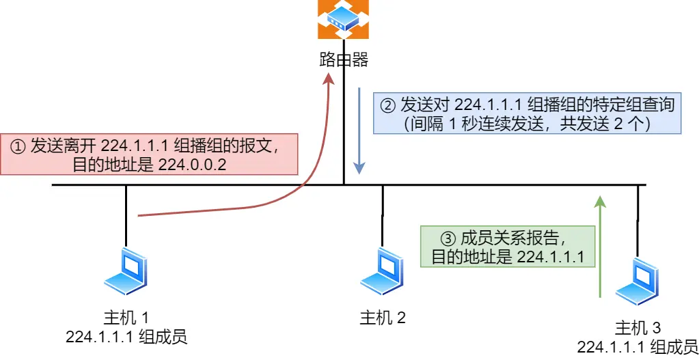

离开组播组的情况二，网段中没有该组播组：

主机 1 要离开组播组 224.1.1.1，发送 IGMP 离组报文。 路由器收到该报文后，以 1 秒为间隔连续发送 IGMP 特定组查询报文（共计发送 2 个）。此时在该网段内，组 224.1.1.1 已经没有其他成员了，因此没有主机响应这个查询。 一定时间后，路由器认为该网段中已经没有 224.1.1.1 组播组成员了，将不会再向这个网段转发该组播地址的数据包。

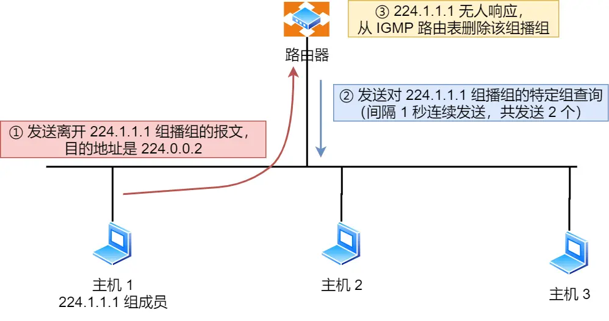