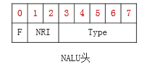

#### 视频播放器原理

封装格式数据(MP4、MKV、FLV)---->解封装格式----->音频压缩数据(AAC、MP3)--->音频解码--->音频采样数据(PCM)

​                                                                                  ----->视频压缩数据(H.264,MPEG2)--->视频解码--->视频像素数据(YUV)


--->音画同步


mediaInfo 查看视频格式


#### 封装格式(avi,mp4,ts,flv,mkv,rmvb) 

MPEG2-TS  1888bytes---

FLV   文件头+数据大小不一定的Tag(有视频和音频格式)


#### 视频编码格式

Elecard Stream Eye

HEVC(H.265)  H.264  MPEG4  MPEG2  VP9  VP8  VC-1


##### h264格式简介

大小不固定的NALU的数据(压缩)--->压缩100倍以上

i帧体积大(全部存储)

p帧体积中(只存储和i帧不一样的 只预测前向)

b帧体积小(和p帧类似 双向预测)


#### 音频编码格式

AAC AC-3 MP3 WMA

AAC

由ADTS组成(大小不固定)


#### 视频像素数据

保存了每个像素点的像素值

格式RGB24 RGB32 YUV420P YUV422P

体积非常大

YUV Player查看工具


#### RGB格式 

RGB由red green blue组成

存一个个点 的亮度和色度信息


#### YUV格式

Y只有亮度 UV只有色度 UV压缩了一半信息

亮度与色度分离 提高压缩效率

首先存整幅画面的亮度信息

然后再存U和V的色度信息


#### 音频采样数据

pcm格式(左右声道交替) 一个个点构成

保存每个采样点的值

Adobe AUDITION


#### ffmpeg 生成测试文件

ffmpeg -f lavfi -i color=c=red:s=640x480:d=5 -c:v mjpeg output.avi

```
-f lavfi：使用 FFmpeg 的过滤器作为输入

color=c=red:s=640x480:d=5：生成一个 640x480、5 秒红色画面的虚拟视频

-c:v mjpeg：编码器设为 MJPEG，适配 AVI

output.avi：输出文件名

你也可以换成 blue、white、black 等颜色。
```


#### ffmpeg常用命令

```
-h 帮助
-i filename 输入文件
-t duration 设置处理时间(视频中的时间)格式hh:mm:ss
-ss position 设置起始时间(视频从哪里开始)格式hh:mm:ss
-b:v bitrate 设置视频码率 清晰度
-b:a bitrate 设置音频码率
-r fps 帧率 卡顿
-s wxh 设置帧大小 格式为WxH 分辨率大小 
-c:v codec 设置视频编码器
-c:a codec 设置音频编码器
-ar freq 设置音频采样率
```

####  ffmplay 播放文件 

```
空格 p 暂停
f 全屏
q ecs 退出
```

#### FFmpeg库

```
avcodec 编解码库
avformat 封装格式处理
avfilter 滤镜格式处理
avdevice 设备输入输出
avutil 工具库
postproc 后加工
swresample 音频采样数据格式转换
swscale 视频像素数据格式转换
```


ffmpeg解码过程

av_register_all()


SDL多线程函数

SDL_CreateThread 创建一个线程

SDL_Thread 线程句柄

SDL事件

SDL_WaitEvent()等待一个事件

SDL_PushEvent()发送一个事件

数据结构

SDL_Event：代表一个事件


# 🎯 什么是关键帧（Keyframe）和非关键帧（Non-keyframe）？

在视频编码中，**并不是每一帧都完整保存图像数据**。为了节省空间，大部分帧只保存“与前一帧的差异”。这就引出了三种核心帧类型：

------

## 🔹 1. I 帧（关键帧，Intra-coded Frame）

- ✅ **完整图像数据**
- ✅ 不依赖其他帧
- ✅ 快进/seek 跳转只能跳到 I 帧
- 📦 文件体积大，占带宽高

> 可以类比为：视频中的“全景照”

------

## 🔹 2. P 帧（预测帧，Predicted Frame）

- ❌ 不完整，**依赖前面的 I/P 帧**
- ✅ 编码高效，占用空间小
- 📉 不适合做 seek 起点

> 类比为：你告诉别人“和上一帧相比，我这里只动了一个手”

------

## 🔹 3. B 帧（双向预测帧，Bi-predictive Frame）

- ❌ 依赖前后的 I/P 帧
- ✅ 压缩率最高，但解码顺序复杂
- 📉 解码性能要求高，不适合实时性场景

> 类比为：“我介于前后两帧之间”

------

## ✅ 支持 I/P/B 帧的视频格式有哪些？

| 视频格式   | 是否使用关键帧 | 是否有 B 帧 | 说明                  |
| ---------- | -------------- | ----------- | --------------------- |
| H.264      | ✅ 有           | ✅ 支持      | 主流格式，常用 B 帧   |
| H.265/HEVC | ✅ 有           | ✅ 支持更多  | 压缩率更高            |
| AV1        | ✅ 有           | ✅ 更复杂    | 新一代高效编码格式    |
| MPEG-2     | ✅ 有           | ✅           | TS 中常用             |
| VP8/VP9    | ✅ 有           | ✅           | Google 系视频格式     |
| ProRes     | ✅ I 帧为主     | ❌ 无        | 苹果无损格式，仅 I 帧 |
| MJPEG      | ✅ 全是 I 帧    | ❌ 无        | 类似图像序列          |

## 🧱 TS 格式结构（简要）

每个 TS 文件由许多 **188 字节** 的数据包组成：

```
python复制编辑+------------+------------+------------+------------+
| Packet #1  | Packet #2  | Packet #3  | Packet #4  |
|  188 bytes |  188 bytes |  188 bytes |  188 bytes |
+------------+------------+------------+------------+
```

每个包可能包含：

- 音频帧
- 视频帧（可能是关键帧或非关键帧）
- PAT/PMT 表（节目信息）
- PES（Packetized Elementary Stream）


### h264协议

#### NAL

**NALU（网络抽象层单元）** 是视频编码流中的基本单元，是编码后的视频数据切分成的小包。每个 NALU 代表了编码视频数据的一个片段，比如一帧中的一个片段或者一段特定类型的数据。


**起始码（Start Code）**
 一般是 `0x000001` 或 `0x00000001`，用来标识一个 NALU 的开始。

**NAL 头（NAL Header）**
 包含了 NALU 类型、优先级等信息。



forbidden_zero_bit (F，占1bit)
在 H.264 规范中规定了这⼀位必须为 0 。

nal_ref_idc (NRI，占2bit)
NAL重要性，值越大，越重要，解码器在解码处理不过来的时候，可以丢掉重要性为0的NALU，而不影响图像的回放 。 如果当前NALU是属于参考帧的片，或是序列参数集，或是图像参数集这些重要的单位时，本句法元素必需大于0。

nal_unit_type(Type，占5bit)：

这个NALU单元的类型，1～12由H.264使用，24～31由H.264以外的应用使用。

**有效负载（RBSP: Raw Byte Sequence Payload）**
 具体的编码视频数据。


**SODB（String Of Data Bits）**：
 这是编码后产生的原始比特流，也就是压缩后的视频数据，还没有字节对齐。

**RBSP（Raw Byte Sequence Payload）**：
 是对 SODB 的封装格式。它是在 SODB 后面添加了 **RBSP Trailing Bits**（尾部补齐位）来补齐成字节。这样，RBSP 的数据是字节对齐的，方便后续处理。

- RBSP Trailing Bits 通常是：
   一个 1 比特，后面跟若干个 0 比特，直到补齐 8 位。

**EBSP（Encapsulated Byte Sequence Payload）**：
 是在 RBSP 基础上再插入防竞争字节 `0x03` 的版本。
 这是为了避免比特流中出现类似起始码（`0x000001`）的字节序列，防止误解析起始码。

#### 特殊的 rbsp

**SPS（Sequence Parameter Set，序列参数集）**nal type 7
 描述整个视频序列的全局参数，比如视频分辨率、帧率、编码工具等。
 它定义了序列级别的编码信息，供解码器初始化和解码参考。

**PPS（Picture Parameter Set，图像参数集）** nal type 8
 描述单个图像（帧）或图像组的参数，比如片的划分方式、熵编码方式等。
 它定义了具体帧的编码设置细节。

####  视频的 rbsp VCL

#### 

序列 (Sequence)
 └─ 图像/帧 (Frame / Picture)
      └─ 片 (Slice)
           └─ 宏块 (Macroblock)
                └─ 块 (Block)

### **序列（Sequence）**：视频编码的最高层次，表示一段连续的视频流。

### **图像/帧（Frame/Picture）**：序列中的一张完整图片。

#### 常见帧类型

1. **I帧（Intra-coded Frame，关键帧）**

- 完全独立编码，不依赖其他帧。
- 内部只使用帧内预测，包含完整图像信息。
- 解码时可以直接恢复画面。
- 用于随机访问点（seek点），刷新图像。
- 通常体积较大。

1. **P帧（Predicted Frame，预测帧）**

- 依赖之前的 I帧或 P帧进行编码。
- 利用帧间运动估计和补偿减少冗余。
- 体积小于 I帧，但依赖参考帧解码。
- 只能向前预测。

1. **B帧（Bi-directional Predicted Frame，双向预测帧）**

- 同时依赖之前和之后的 I帧或 P帧进行编码。
- 通过双向运动补偿达到更高压缩率。
- 体积通常最小，但解码复杂度高。
- 需要先解码参考帧才能解码。

1. **SI帧和SP帧**（在某些标准中）

- 特殊类型的帧，支持流切换和快速切换。
- 在一般视频编码里不常见。

### **片（Slice）**：一帧可以被分割成多个片，每个片是编码单元，解码器可以独立处理。片可以提高错误恢复能力和并行处理效率。


#### 1. 常见的Slice划分模式

H.264标准定义了几种 slice 切分方式，主要有以下几类：

### （1）单Slice模式（Single Slice Mode）

- 一帧只有一个slice，也就是整个帧作为一个slice，不划分子区域。
- 简单，但抗丢包能力差。

### （2）固定宏块数的Slice（Slice per fixed number of macroblocks）

- 按固定数量宏块划分，比如每slice包含N个宏块。
- N可以自定义，比如每slice 50个宏块。

### （3）固定行数的Slice（Slice per fixed number of rows）

- 按照行数划分slice，比如每slice包含几行宏块。
- 最常用的划分方式之一。
- 例如，一帧有120行宏块，按每slice 10行划分，则有12个slice。

### （4）多Slice组（Multiple slice groups）

- 允许用更灵活的方式划分slice，可以不连续。
- 用于区域保护、错误隐藏等高级应用。
- H.264中通过Slice Group Map进行映射，支持多种map类型（如格子型、对角线型等）。

**宏块（Macroblock）**：16×16像素的编码基本单位，包含亮度和色度分量。

###  运动预测（Motion / Prediction）

- **帧内预测（Intra Prediction）**
  - 利用同一帧的邻近宏块数据预测当前宏块
  - 减少空间冗余（相邻像素往往相似）
- **帧间预测（Inter Prediction）**
  - 利用参考帧（前帧或后帧）的宏块进行预测
  - 减少时间冗余（连续帧差异不大）

**块（Block）**：宏块内更小的像素块，如4×4或8×8，用于变换和量化。

### yuv

####  YUV420 的命名规则（ITU-R BT.601）

格式写作 **YUV 4:2:0**，三个数字分别表示：

| 数字     | 含义                                                         |
| -------- | ------------------------------------------------------------ |
| 第一个 4 | 水平方向参考单位内的 Y 样本数（通常就是 亮度分量 Y 的像素数） |
| 第二个 2 | 水平方向内色度分量（U/V）采样数与 Y 的比例（2 表示水平压缩 2 倍） |
| 第三个 0 | 垂直方向内色度分量采样数与 Y 的比例（0 表示垂直方向压缩 2 倍，即 2×2 像素共用 1 个 U/V） |

### MP4

#### File Type Box

offset  size  field
0       4     size         // 包括 size + type + 数据
4       4     type = 'ftyp'
8       4     major_brand
12      4     minor_version
16      ...   compatible_brands[n*4]

#### Movie Box

moov (size_moov, type='moov')                // 容器 Box，包含所有轨道和全局信息
├── mvhd (size_mvhd, type='mvhd')            // 叶子 Box：电影全局信息（时长、时间基准等）
├── trak (size_trak1, type='trak')           // 容器 Box：视频轨道
│   ├── tkhd (size_tkhd, type='tkhd')        // 叶子 Box：轨道头（ID、尺寸、时长）
│   ├── mdia (size_mdia, type='mdia')        // 容器 Box：轨道媒体信息
│   │   ├── mdhd (size_mdhd, type='mdhd')    // 叶子 Box：媒体时长、时间基准
│   │   ├── hdlr (size_hdlr, type='hdlr')    // 叶子 Box：轨道类型（video/audio）
│   │   └── minf (size_minf, type='minf')    // 容器 Box：媒体信息
│   │       └── stbl (size_stbl, type='stbl')// 容器 Box：样本表
│   │           ├── stsd (size_stsd, type='stsd') // 叶子 Box：编码类型（avc1/mp4a）
│   │           ├── stts (size_stts, type='stts') // 叶子 Box：时间到样本映射
│   │           ├── stsc (size_stsc, type='stsc') // 叶子 Box：样本到 chunk 映射
│   │           ├── stsz (size_stsz, type='stsz') // 叶子 Box：样本大小表
│   │           └── stco (size_stco, type='stco') // 叶子 Box：chunk 偏移表
├── trak (size_trak2, type='trak')           // 容器 Box：音频轨道
│   ├── tkhd (size_tkhd2, type='tkhd')       // 叶子 Box：音频轨道头（ID、声道数、时长）
│   ├── mdia (size_mdia2, type='mdia')       // 容器 Box：音频轨道媒体信息
│   │   ├── mdhd (size_mdhd2, type='mdhd')   // 叶子 Box：音频时长、时间基准
│   │   ├── hdlr (size_hdlr2, type='hdlr')   // 叶子 Box：轨道类型（audio）
│   │   └── minf (size_minf2, type='minf')   // 容器 Box：音频媒体信息
│   │       └── stbl (size_stbl2, type='stbl')// 容器 Box：音频样本表
│   │           ├── stsd (size_stsd2, type='stsd') // 叶子 Box：音频编码类型（mp4a）
│   │           ├── stts (size_stts2, type='stts') // 叶子 Box：时间到样本映射
│   │           ├── stsc (size_stsc2, type='stsc') // 叶子 Box：样本到 chunk 映射
│   │           ├── stsz (size_stsz2, type='stsz') // 叶子 Box：样本大小表
│   │           └── stco (size_stco2, type='stco') // 叶子 Box：chunk 偏移表
└── 其他 trak（可选字幕轨、数据轨等）     // 每条轨道结构类似

#### Media Data Box

**纯媒体数据**，不包含帧时间、帧大小等索引信息，这些都在 `moov` 的 `stbl`（Sample Table Box）里记录。

mdat
├── size (4 bytes)   # box总长度
├── type (4 bytes)   # 'mdat'
└── payload          # 编码后的音视频比特流


### AAC 

#### 7 字节 ADTS 头（`protection_absent = 1`，无 CRC）

| 字节 | 比特位 | 字段                                                         | 说明                                                         |
| ---- | ------ | ------------------------------------------------------------ | ------------------------------------------------------------ |
| 1    | 7~0    | syncword [11:4]                                              | 12 bit 同步字的高 8 bit，固定 0xFFF                          |
| 2    | 7~4    | syncword [3:0]                                               | 12 bit 同步字的低 4 bit                                      |
|      | 3      | ID                                                           | 1 bit，0=MPEG-4,1=MPEG-2                                     |
|      | 2~1    | Layer                                                        | 2 bit，固定 00                                               |
|      | 0      | protection_absent                                            | 1 bit，1=无 CRC                                              |
| 3    | 7~6    | profile                                                      | 2 bit，AAC Profile（0=Main,1=LC,2=SSR,3=Reserved）           |
|      | 5~2    | sampling_frequency_index                                     | 4 bit，采样率索引（0~12）                                    |
|      | 1      | private_bit                                                  | 1 bit，用户自定义                                            |
|      | 0      | channel_configuration 高位                                   | 1 bit，channel_configuration 的第 3 bit                      |
| 4    | 7~6    | channel_configuration 低 2 bit                               | 3 bit 总共组成 channel_configuration（1=单声道,2=立体声,3~7=多声道） |
|      | 5      | original/copy                                                | 1 bit，原始或拷贝标志                                        |
|      | 4      | home                                                         | 1 bit，home 标志                                             |
|      | 3      | copyright_identification_bit                                 | 1 bit，版权标识                                              |
|      | 2      | copyright_identification_start                               | 1 bit，版权开始                                              |
|      | 1~0    | aac_frame_length 高 2 bit                                    | 与下一字节组合成 13 bit AAC 帧长度                           |
| 5    | 7~0    | aac_frame_length 中间 8 bit                                  | 与上一字节/下一字节组合，形成完整 13 bit                     |
| 6    | 7~5    | aac_frame_length 低 3 bit                                    | 与上一字节组合完成 13 bit                                    |
|      | 4~0    | adts_buffer_fullness 高 5 bit                                | 11 bit 缓冲区满度的一部分                                    |
| 7    | 7~0    | adts_buffer_fullness 低 6 bit + number_of_raw_data_blocks 2 bit | 完整 11 bit buffer fullness + 2 bit 表示每帧 Raw Data Block 个数 |

#### `protection_absent = 0`，有 CRC

8-9字节 为 crc 其余不变

#### profile分类

| ADTS 中 profile 字段值 | 实际 Object Type（profile）    | 常见名称         |
| ---------------------- | ------------------------------ | ---------------- |
| 0                      | 1 ⇒ **Main profile**           | AAC Main         |
| 1                      | 2 ⇒ **Low Complexity profile** | AAC LC（最常见） |
| 2                      | 3 ⇒ **SSR profile**            | AAC SSR          |

####  AAC Raw Data (frame) 

### 1️⃣ 帧（Frame）

- AAC 的最小解码单位是 **Frame**，LC Profile 每帧对应 **1024 个时域采样点**（短窗模式下 128 个）。
- 每帧都有一个 **ADTS Header**（如果是 ADTS 封装），告知长度、采样率索引、声道数、profile。
- **注意**：ADTS header 里只能粗略标明 profile（Main/LC/SSR），真正扩展 profile 在 ASC 里。

------

### 2️⃣ 窗口与分组（Window Group）

- 时域采样点先被切成 **Window（窗口）**。
  - 普通 LC 使用 **长窗（1024）**
  - 瞬态信号可切短窗（128采样）
- 多个窗可能被分成 **Window Group**，用于后续频域编码。


### 2️⃣ 长窗 vs 短窗区别

| 特性                     | 长窗     | 短窗   | 解释                                                         |
| ------------------------ | -------- | ------ | ------------------------------------------------------------ |
| **时间分辨率**           | 低       | 高     | 时间分辨率 = 能多快分辨出音频变化。长窗覆盖时间长，短窗覆盖时间短，更能精确捕捉突发音。 |
| **频率分辨率**           | 高       | 低     | 频率分辨率 = 能多精确分辨不同音高。长窗可更精细区分频率，短窗区分度差一些。 |
| **适用信号**             | 平稳音   | 瞬态音 | 根据音频特点选择不同窗类型。                                 |
| **量化效率**             | 高       | 较低   | 量化 = 将连续幅值用有限比特表示。长窗压缩效率高，短窗稍低。  |
| **Pre-echo（提前回声）** | 可能出现 | 较少   | Pre-echo = 突发声音的能量被长窗扩散到前面，听起来像回声，短窗能减少这种现象。 |

------

### 3️⃣ 频率带（Scale Factor Band）

- 每个窗口被划分为 **频率带（band）**，对应人耳听觉临界带。
- 每个 band 有 **scale factor（缩放系数）**，用于量化系数。
- band 数目、宽度每 profile 和采样率可能不同。

------

### 4️⃣ Section（Huffman 分块）

- 连续若干个 band 使用相同 **Huffman codebook** 被打包成一个 **Section**。
- 每个 Section 开头有 section info，告诉解码器：
  - 使用哪个 codebook
  - 有多少个 band
- 后面紧跟真正的 **Huffman 编码数据**（频域系数）。

------

### 5️⃣ 频谱数据（Spectral Coefficients）

- Huffman 解码得到 **量化 MDCT 系数**。
- 然后乘以 scale factor → 得到逆量化系数。
- 再做 **IMDCT** → 时域 PCM 样本。

